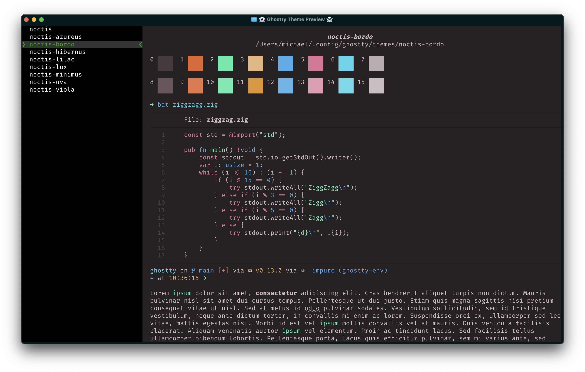
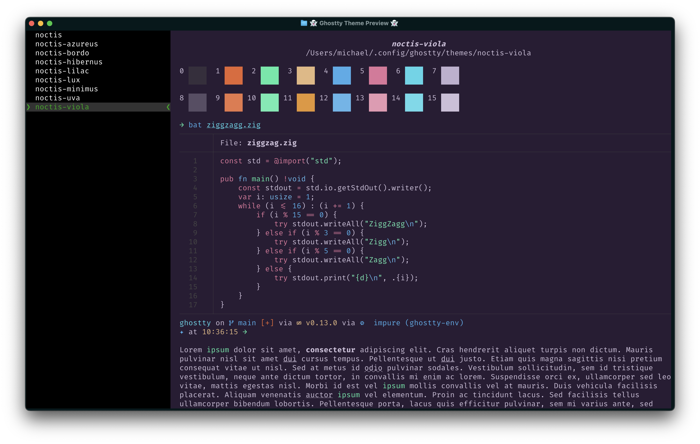

# Ghostty Noctis Themes

> Noctis color schemes for the [Ghostty terminal emulator](https://github.com/ghostty-org/ghostty), based on [Noctis theme](https://github.com/liviuschera/noctis).

## Themes

### Dark Themes

- **Noctis**: The original dark blue theme
- **Noctis Azureus**: Dark theme with azure blue colors
- **Noctis Bordo**: Dark theme with burgundy colors
- **Noctis Minimus**: Dark theme with muted blue colors
- **Noctis Uva**: Dark theme with grape colors
- **Noctis Viola**: Dark theme with violet colors

### Light Themes

- **Noctis Lux**: Light theme with warm colors
- **Noctis Lilac**: Light theme with lilac colors
- **Noctis Hibernus**: Light theme with cool winter colors

## Installation

```sh
# Create the Ghostty themes directory
mkdir -p ~/.config/ghostty/themes

# Clone the repository
git clone https://github.com/eastsun5566/ghostty-noctis-themes.git

# Copy the themes files
cp ghostty-noctis-themes/themes/* ~/.config/ghostty/themes/
```

Use `ghostty +list-themes` preview the themes

## Usage

Update `~/.config/ghostty/config`

```conf
theme = noctis
```

Or

```conf
theme = dark:noctis,light:noctis-lux
```

## Screenshots

- Noctis


- Noctis Azureus


- Noctis Bordo



- Noctis Minimus


- Noctis Uva


- Noctis Viola



- Noctis Lux


- Noctis Lilac


- Noctis Hibernus


